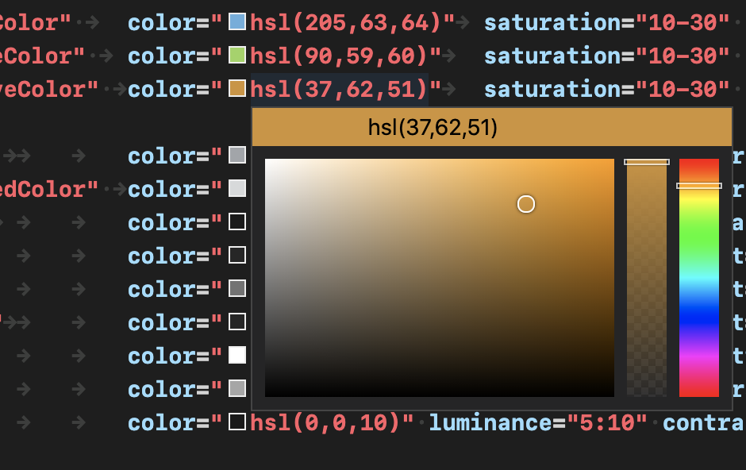
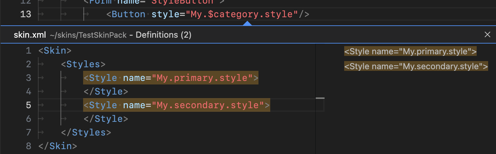
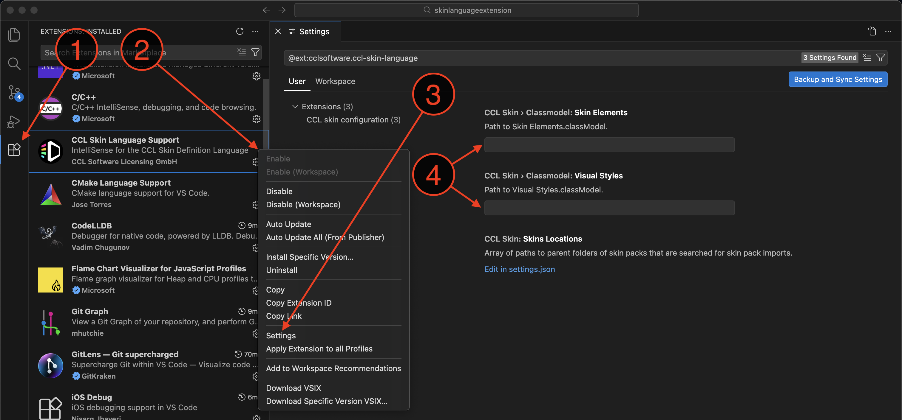
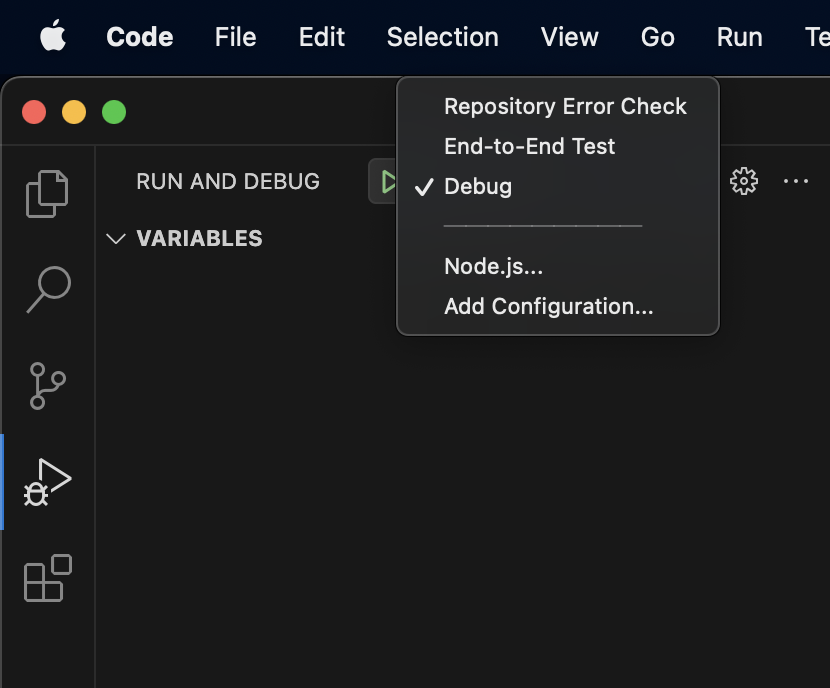

# CCL Skin Language Support

CCL Skin Language Support is a Visual Studio Code extension to enable IntelliSense when editing files in the CCL Skin Definition Language. The current version can be installed from the [Visual Studio Code marketplace](https://marketplace.visualstudio.com/items?itemName=cclsoftware.ccl-skin-language).

This repository contains two sorts of builds:
1. .vsix builds that can be installed manually in Visual Studio Code
2. .js builds (from version 0.9.0 onwards) that can be used in continuous integration environments or to locally scan a codebase for errors. To run these builds, a [node.js](https://nodejs.org/) installation is required. If node.js is present, make sure the current working directory is inside the codebase you want to check and run
```
node <path/to/checkskinerrors.js>
```
To ignore certain directories inside the code base, append
```
-ignore "<relative/path/to/dir1> <relative/path/to/dir2>"
```
If any file's absolute path contains one of the ignore patterns, it is ignored by the script.

## Supported Features

**Hover documentation**

When hovering over elements in a skin XML document, the corresponding documentation taken from the `Skin Elements.classModel` is displayed in a popup window.

When hovering over variables, the possible values are displayed. For relative URLs, the absolute paths are displayed.

**Document validation**

Error squiggles are shown for any classes, attributes or attribute values that are not defined in the scope or have invalid values.

**Autocomplete**

For any styles, colors, enums, URLs, forms, variables, and attribute names, autocompletion information is provided based on the definitions in the classmodel and on all definitions in the currently edited skin pack.

**Color editor**

For concrete color definitions, the color is indicated using a little square preceding the color definition and a color editor opens on hover.



**Go to definition**

For references to style, color, shape, image and form definitions or URLs, go to definition is available by right-clicking the definition or hitting *F12*. When going to a definition containing a skin variable, it can happen that multiple definitions are found since the variable can have different values. In this case, all possible definitions are shown.



**Find All References**

When right-clicking a symbol (i.e. the name of a form, style, color, shape, ...) "Find All References" is available. This command finds every source location in the repository that references the same definition as the right-clicked symbol.

**Rename Symbol**

When right-clicking a symbol (i.e. the name of a form, style, color, shape, ...) "Rename Symbol" is available. This command allows entering a new name for the selected symbol and renames all references to the symbol across the whole repository.

## Troubleshooting

### Missing hover information

If the XML hover information is not displayed, it might be required to setup the path to the otherwise auto detected `Skin Elements.classModel` and `Visual Styles.classModel` files:



1. Go to the *Extensions* tab in the main toolbar
2. Right-click *CCL Skin Language Server*
3. Go to *Extension Settings*
4. Insert absolute paths to the class model files

# Development

As a prerequisite, install Node.js 18 or later (https://nodejs.org/). Then to install all required dependencies, run:

```
cd <framework repository>/tools/ccl/skinlanguageextension
npm install
```

Developing the extension is done in VS Code itself. In VS Code, open the folder

```
<framework repository>/tools/ccl/skinlanguageextension
```

## Run Options

In the Run and Debug tab of the main toolbar on the left, several configurations are available.



### Repository Error Check

This runs a script that traverses the whole repository and checks every skin XML file for errors. The result is printed to the console. This script can be used to get an overview over all errors in the repository and when developing the language server it is helpful to compare the output after the changes with the output before in order to catch any newly introduced bugs. Another use case is to run this script as part of the continuous integration. To run the script manually do:

```
cd <framework repository>tools/ccl/skinlanguageextension/server/test
tsc
node ../out/test/test/fulldirectorytraverse.js
```

Alternatively you can run the continuous integration build `checkskinerrors.js` from within the repository.

### Debug

To develop and debug the extension, select `Debug` and hit the green arrow to launch the extension. A new VS Code window is opened. The current development state of the extension now runs in this VS Code window. Open a skin XML file from the repository to start debugging. All entrypoints can be found in

```
server/server.ts
```

When performing actions in the code like hovering, requesting autocomplete or editing, the callbacks in server.ts are invoked and the requested information is calculated and returned.

### End-to-End Test

There is a small end-to-end testsuite implemented that can be run using the `End-to-End Test` launch configuration. Running the tests also launches a new VS Code window that executes the extension. The tests use the extension as black box by triggering user interactions programmatically and comparing the language server output to the expected output in the test case.

The test cases can be found in

```
client/src/test
```

When dealing with hard-coded positions, please note that the tests are run on the file

```
client/testFixture/MySkinPack/skin.xml
```

The positions are zero based, so using the line number and character VS Code shows in the status bar will not work. The line number is one lower than what VS Code shows and the character can be completely off because VS Code counts tab characters as multiple characters depending on the indentation width.

## Build

To build the installable `CCLSkinLanguageSupport.vsix` file, run

```
<framework repository>/tools/ccl/skinlanguageextension/scripts/build.sh
```

The build script writes the output extension .vsix package to

```
<framework repository>/tools/ccl/skinlanguageextension/build
```

> **Note**
> 
> An existing file from a previous build is overwritten.

The version number can be found in `package.json` in the language server root folder and should be increased before a new release, see [Release Checklist](#release-checklist).

## CI Build

To build `checkskinerrors.js` for use in a continuous integration environment, run

```
cd <framework repository>/tools/ccl/skinlanguageextension
npm run ci-build
```

To use this build, change the working directory to be inside the project that should be checked (usually within the folder that contains `repo.json`) and run

```
node <path/to/checkskinerrors.js>
```

## Release Checklist

1. Update the version in `package.json`
2. Update `changelog.md` to reflect the changes of the new release
3. Make sure the release date is set in `changelog.md`
4. Run the build script in `scripts/build.sh`
5. Copy the build products `CCLSkinLanguageSupport.vsix` and `checkskinerrors.js` to a new folder inside the `releases` folder.
6. Commit everything that has changed, including `package.lock.json` and the new release folder inside `releases`.
7. Upload `CCLSkinLanguageSupport.vsix` to https://marketplace.visualstudio.com/manage/publishers/cclsoftware.
